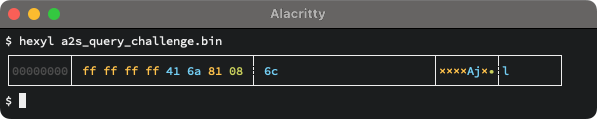
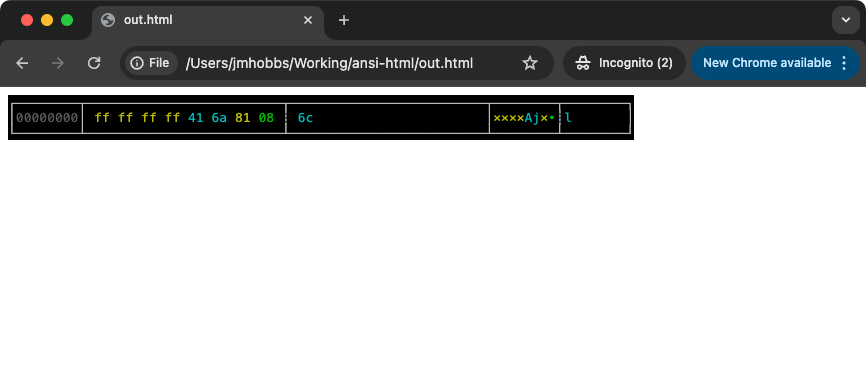

# ansi-html

A simple tool to emit HTML from text that includes ANSI escape codes.

Pipe ANSI into it, get HTML out.  It is all class based, so you can customize the output with CSS.

A default CSS file is included as an example.

## Example

### Terminal

### HTML

